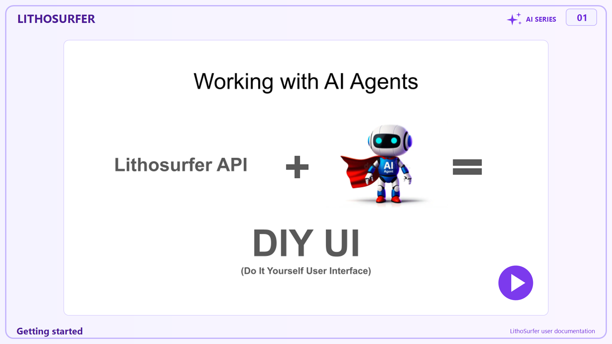

# Getting started

Set up an AI agent that can read this documentation **and** run scripts against the LithoSurfer API on your behalf. Budget about fifteen minutes for the first time.

Two halves: getting set up (steps 1–2 — install an agent, lay out your folders), then proving your LithoSurfer access works (steps 3–4). **Already using Claude Code or Cursor? Start at [step 2](#step-2--set-up-your-folders).**

At the end you will have run a script that lists the data packages you are allowed to write to — which proves your host, credentials and access all work before you attempt a real upload.

---

## Video

<a href="https://drive.google.com/open?id=1hl0WOi8HeldXq94g2IirMlVyrhaDLv4H&usp=drive_fs"></a>

This video shows, step by step, how to go through this chapter.

---

## Use Claude Code in Claude Desktop

This documentation assumes **[Claude Code](https://docs.claude.com/en/docs/claude-code/setup)** running inside the **Claude Desktop** app — the `</> Code` tab. No terminal required: you work in an ordinary window and Claude runs the commands for you.

What matters is that it runs **on your own machine**. It inherits your network, your VPN and your environment variables, so it can reach a LithoSurfer instance that is not public, and it can use credentials that were never typed into the chat. The chat side of the app runs code in a cloud sandbox instead — useful for plenty of things, but it cannot see your local environment.

Prefer a terminal or an IDE? The same agent ships as a command-line tool (`claude`) and as a VS Code / JetBrains extension. Everything below applies unchanged; only the way you start a session differs.

---

## Step 1 — Install Claude Desktop

1. Install **[Claude Desktop](https://claude.ai/download)** and sign in with your Claude account.
2. On Windows, also install **[Git for Windows](https://git-scm.com/download/win)**. It provides the `git` command and a Bash shell, so the examples here work as written.
3. Open the app and switch to the `</> Code` tab. Sessions started there run on your computer and can execute scripts.

That is the whole installation. You will not need a terminal again.

---

## Step 2 — Set up your folders

Keep two folders side by side: this documentation, and your own work.

1. Create an empty folder called `lithosurfer`, wherever you keep your work.
2. In the `</> Code` tab, start a new session in that folder.
3. Ask Claude to set it up:

```text
Clone https://github.com/lithodat-pty-ltd/io.lithosurfer.userdoc.git into this
folder, and create an empty folder called my-project beside it.
```

You should end up with:

```text
lithosurfer/
├── io.lithosurfer.userdoc/   ← this documentation: reference only, never edit
└── my-project/                ← your work: data, scripts, .env
```

**Treat the documentation clone as read-only.** Your scripts, data and credentials belong in your own folder. That keeps `git pull` clean forever — there is nothing local to conflict with — and keeps your lab data out of a repository you do not own.

Update the documentation at any time by asking *"pull the latest version of the documentation"*, or by running `git pull` inside the clone yourself.

Name `my-project` whatever suits the job — `rosebery-2026`, `tasmania-geochem`. Create a new one per project.

---

## Step 3 — Set your credentials

### Use a dedicated account, not your own login

**Register a second LithoSurfer account with a spare email address** — the normal sign-up, the same way you registered the first time. Nobody's permission is needed: sign up, click the activation link, request assignment to your institution to give the agent full permissions, e.g. to create new packages.

An agent acts on what you tell it *and* on what it reads — a mislabelled column, a stray instruction buried in a source file, or simply a request it understood differently than you meant. Whatever the account can reach is the blast radius, and your personal login almost certainly reaches more than one import needs.

A new account starts with access to **nothing**, which is the point: add only what the job requires.

Many mail providers let you invent a spare address on the spot with a `+` suffix — `you+agent@example.org` delivers to your normal inbox. Use the new account's credentials everywhere below, and run [step 4](#step-4--run-the-first-script) as that account: the packages it lists are exactly the ones your agent can damage. If the list is longer than the job needs, trim it before you start.

### Keep the password out of the chat

**Never paste a password into an agent chat window.** Anything you type there is stored in the conversation, may be echoed back in logs, and tends to end up hardcoded in the script the agent writes — one `git add` away from being published. A well-behaved agent will refuse, and it is right to.

The agent does not need your credentials. The *script* does. They belong **in your own project folder**, not in the documentation clone.

Ask Claude to put the template in place:

```text
Copy io.lithosurfer.userdoc/00_getting-started/.env.example to my-project/.env
```

Then open `my-project/.env` in a text editor **yourself** and fill in your login. This is the one step you do by hand, and that is deliberate — the password never passes through the chat:

```bash
LITHOSURFER_USER=your-login
LITHOSURFER_PASSWORD=your-password
LITHOSURFER_HOST=https://app.ausgeochem.org
```

The agent writes code that reads these variables by name and never has to see their values. If you ever put `my-project` under version control, add `.env` to its `.gitignore` first.

Prefer not to store the password at all? Leave `LITHOSURFER_PASSWORD` out and the script prompts for it each run.


| Setting                | Notes                                                                      |
| ---------------------- | -------------------------------------------------------------------------- |
| `LITHOSURFER_USER`     | The dedicated agent account's email address                                |
| `LITHOSURFER_PASSWORD` | Your password. Omit to be prompted instead                                 |
| `LITHOSURFER_HOST`     | Defaults to `https://app.ausgeochem.org`. Change it for another deployment |


---

## Step 4 — Run the first script

Ask Claude to run it from your project folder, so it picks up the `.env` you just created:

```text
Run io.lithosurfer.userdoc/00_getting-started/list_my_packages.py from the
my-project folder.
```

Or run it yourself, if you have a terminal open anyway:

```bash
cd my-project
python ../io.lithosurfer.userdoc/00_getting-started/list_my_packages.py
```

It needs only Python 3.8+ and no third-party packages.

```text
Host: https://app.ausgeochem.org
User: your-login

2 writable data package(s):

      ID  WORKFLOW      DISTRIBUTION  NAME
--------  ------------  ------------  ----------------------------------------
   12345  IN_PROGRESS   PRIVATE       Rosebery geochem import 2026-08
   12801  FINISHED      PUBLIC        Tasmania regional survey

Note: package(s) 12801 are FINISHED or FROZEN and reject writes despite your access.

Use one of these IDs as dataPackageId when you upload.
```

The ID from this list is the `dataPackageId` every write operation needs.


| Result                      | Meaning                                                                                                                              |
| --------------------------- | ------------------------------------------------------------------------------------------------------------------------------------ |
| A list of packages          | Everything works. Note the ID you intend to write into — and check the rest of the list is access you are happy for an agent to have |
| `No writable data packages` | Login works, but you are not an editor on anything — ask your institution admin or Lithodat for editor access                        |
| `HTTP 401`                  | Wrong credentials, or the account is not activated on this host                                                                      |
| `Could not reach …`         | Wrong host name, or the instance needs a VPN connection                                                                              |


---

## Step 5 — Hand over to the agent

Start your sessions in the **parent** `lithosurfer` folder, so Claude can see the documentation and your project at once — the same folder you used in step 2. From the terminal that is `cd lithosurfer && claude`.

Open every session by telling it which folder is which. This is the single most useful sentence you can type:

```text
Use ./io.lithosurfer.userdoc as reference documentation — read it, never
edit it. Do all work in ./my-project.
```

Then describe the task:

```text
Summarise how I upload geochemistry data.
```

```text
Using io.lithosurfer.userdoc/00_getting-started/list_my_packages.py as the
pattern for authentication, write a script in my-project/ that counts the
samples in data package 12345.
```

```text
I have a lab export at my-project/rosebery.xlsx. Walk me through preparing it
for upload, following 03_writing-data/upload-geochemistry-data/.
```

Three habits worth keeping:

- **Say where work goes.** Without it the agent may write into the documentation clone, and your next `git pull` will complain.
- **Refer to credentials by variable name**, never by value — `read LITHOSURFER_PASSWORD from the environment`, not the password itself.
- **Ask for a dry run first.** Batch uploads are all-or-nothing. Have the agent send a handful of records, check them in the UI, then run the rest.

---

## What the agent should know

Point it at these once it is running:


| Question                               | Doc                                                                   |
| -------------------------------------- | --------------------------------------------------------------------- |
| How the data model fits together       | [Data hierarchy](../01_using-the-api/data-hierarchy.md)               |
| Why a write was rejected               | [Packages and access](../01_using-the-api/packages-and-access.md)     |
| Exact endpoints and field names        | [Endpoints and Swagger](../01_using-the-api/endpoints-and-swagger.md) |
| Turning `Zr` into the ID the API wants | [Reference lists](../01_using-the-api/reference-lists.md)             |
| Loading many records at once           | [Batch upload via API](../03_writing-data/batch-upload-via-api/)      |


Swagger UI for the production host: [https://app.ausgeochem.org/swagger-ui.html](https://app.ausgeochem.org/swagger-ui.html)

---

## Troubleshooting


| Symptom                                            | Cause                                                       | Fix                                                                                                      |
| -------------------------------------------------- | ----------------------------------------------------------- | -------------------------------------------------------------------------------------------------------- |
| The agent refuses to accept your password          | You pasted it into the chat                                 | Put it in `.env` instead (step 3) — the refusal is correct                                               |
| The agent cannot run scripts, or reports a sandbox | You are in the chat side of the app, not the `</> Code` tab | Start the session from the `</> Code` tab (step 1)                                                       |
| `git: command not found`, or cloning fails         | Git is not installed                                        | Install Git for Windows (step 1)                                                                         |
| `python: command not found`                        | Python missing from PATH                                    | Install Python 3, or try `python3`                                                                       |
| Commands in the docs fail on Windows               | Shell fell back to PowerShell                               | Install Git for Windows (step 1)                                                                         |
| `HTTP 401` on every call                           | Token expired mid-session                                   | Tokens are short-lived; re-run the script to fetch a new one                                             |
| Empty search results you expected data in          | The server filters by access before returning               | Set `allowedAccess` on the query — see [packages and access](../01_using-the-api/packages-and-access.md) |
| `git pull` reports local changes in the docs clone | The agent wrote into the documentation folder               | `git checkout .` there to discard, and tell the agent to work in your own folder (step 5)                |
| The script cannot find your credentials            | `.env` is not in the folder you ran from                    | Run from your project folder, or export the variables in your shell                                      |


